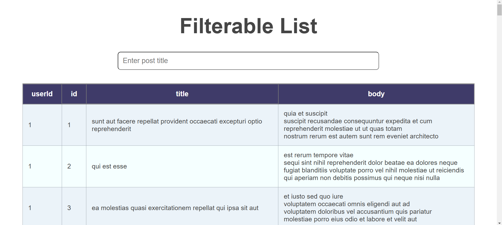

# Filterable List



## Description
The Filterable List project focuses on reactive data fetching from a server, providing users with a dynamic and responsive experience. The application includes input validation to ensure that user entries are appropriate, along with robust handling of specific symbols to enhance data integrity.

# Features
- Reactive Data Fetching:
- Automatically updates the list based on user input and server responses.
- Input Validation: Ensures that user inputs are valid and formatted correctly.
- Symbol Handling: Correctly manages special characters and symbols to prevent errors and enhance data accuracy.
- Filter Options: Users can filter the list based on various criteria for better data management.
Technologies
- HTML: Structure of the application.
- CSS: Styling for an intuitive and appealing user interface.
- JavaScript: Logic for fetching data, validation, and handling user interactions.

## Installation
- Clone the repository:
    ```bash
    git clone https://github.com/yourusername/filterable-list.git
    ```
- Navigate to the project directory:
    ```bash
    cd filterable-list
    ```
- Open the index.html file in your web browser.
## Usage
Enter your search criteria in the input field.
The list will update automatically based on valid input.
Enjoy seamless filtering and interaction with the data.